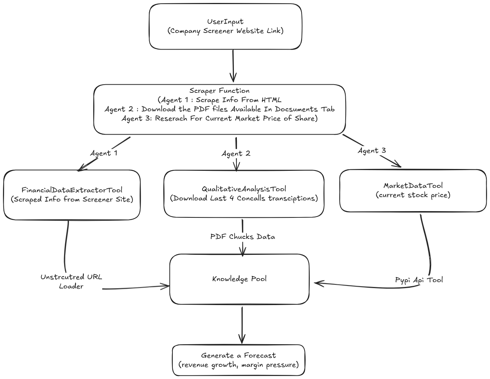

# 📊 Financial Forecasting Agent — Screener.in (TCS Case Study)

An AI-powered financial forecasting system built using **FastAPI**, **Streamlit**, **LangChain**, **Groq LLM**, and **RAG (Retrieval-Augmented Generation)**.
The agent automatically downloads quarterly financial reports & earnings transcripts, extracts insights, and generates **structured, machine-readable qualitative forecasts** for Tata Consultancy Services (TCS) or any Screener-supported company.

This project is built as per the assignment specification for:
**“Financial Forecasting Agent for TCS”**

---

# 🔍 Key Features

### ✅ **Automatic Document Retrieval**

* Scrapes **financial reports, earnings call transcripts, investor presentations** directly from Screener.in
* Downloads PDFs into a clean working directory
* Optionally scrapes the company page for additional web context

### ✅ **RAG-Based Retrieval & Chunking**

* Splits documents using `RecursiveCharacterTextSplitter`
* Builds a FAISS vector store for semantic search
* Supports multi-question querying after index creation

### ✅ **Forecasting Agent**

* Uses Groq’s **gpt-oss-120b** model
* Analyzes **quantitative** and **qualitative** financial information
* Produces structured JSON outputs only
* Includes forward-looking commentary, risks, opportunities, and analyst-grade insights

### ✅ **Tools & Modules**

1. **FinancialDataExtractorTool** — extracts metrics like revenue, net profit, margins
2. **QualitativeAnalysisTool** — identifies themes, sentiment, guidance from transcripts
3. **MarketDataTool** (optional) — retrieves live stock prices (NSE India)

### ✅ **Streamlit Frontend**

* Upload URL → Build Vector Store
* Ask Multiple Questions -> JSON Responses
* View Current Market Price

### ✅ **FastAPI Backend**

* `/load` → download & index
* `/ask` → query RAG + LLM
* `/price` → get market price

---

# 🧱 Architecture Overview


---

# 📂 Project Structure

```
├── app.py                           # Streamlit App
├── main.py                          # FastAPI backend
├── research/
│   └── raw_code_clean.py            # Core RAG + Scraper + LLM pipeline
├── pdf_downloads/                   # Auto-managed directory for PDFs
├── faiss_index/                     # Vector store index
├── README.md
└── requirements.txt
```

---

# ⚙️ Technologies Used

| Layer                  | Technology                                 |
| ---------------------- | ------------------------------------------ |
| Backend API            | FastAPI                                    |
| Frontend UI            | Streamlit                                  |
| LLM Provider           | Groq (openai/gpt-oss-120b)                 |
| Retrieval              | FAISS Vector Store                         |
| Embeddings             | FakeEmbeddings (or OpenAI optionally)      |
| Document Loading       | PyPDFLoader, PDFMinerLoader, WebBaseLoader |
| Financial Data         | NSE Live Stock API                         |
| Environment Management | python-dotenv                              |

---

# 📥 Installation Guide

### **1. Clone the Repository**

```bash
git clone https://github.com/<your-repo>/Financial-Forecasting-Agent.git
cd Financial-Forecasting-Agent
```

### **2. Create a Virtual Environment**

```bash
python3 -m venv venv
source venv/bin/activate
```

### **3. Install Dependencies**

```bash
pip install -r requirements.txt
```

### **4. Create `.env` File**

```
GROQ_API_KEY=your_groq_api_key
```

---

# 🚀 Running the Application

You will run **two apps**:

1. FastAPI backend
2. Streamlit frontend

---

## 🟦 1. Start FastAPI Backend

```bash
uvicorn main:app --host 0.0.0.0 --port 8000
```

### API Endpoints

| Endpoint               | Description                          |
| ---------------------- | ------------------------------------ |
| `POST /load`           | Downloads PDFs & builds vector store |
| `POST /ask`            | Ask any financial question           |
| `GET /price?url=<url>` | Get NSE stock price                  |
| `GET /`                | Status check                         |

---

## 🟩 2. Start Streamlit Interface

```bash
streamlit run app.py
```

### Streamlit Steps

1. Enter Screener URL
   Example:

   ```
   https://www.screener.in/company/TCS/consolidated/
   ```
2. Click **Load & Build Vector Store**
3. Ask unlimited questions
4. View JSON results
5. See current market price

---

# 🧠 Example Questions You Should Ask (Assignment-Aligned)

These match the assignment requirements EXACTLY:

### Financial Extraction

```
Extract total revenue, net profit, and EBIT margin for the last two quarters.
```

### Margin & Profitability

```
Explain the key drivers behind margin expansion or contraction across the last two quarters.
```

### Qualitative Transcript Analysis

```
What was the management sentiment in the latest earnings call?
```

### Risks & Opportunities

```
List all major risks and opportunities highlighted by management.
```

### Full Forecast (Assignment Core)

```
Provide a qualitative business forecast for the upcoming quarter based on the last two quarters’ financial reports and transcripts.
```

### Missing Data Detection

```
What essential financial data is missing from the provided documents?
```

---

# 🧪 Example JSON Output (LLM Structured Response)

```json
{
  "stock_symbol": "TCS",
  "current_market_price": "3920",
  "analysis_summary": "Revenue showed modest growth while margins remained stable...",
  "quantitative_insights": {
    "revenue_trend": "...",
    "profitability_trend": "...",
    "margin_notes": "...",
    "other_key_metrics": "..."
  },
  "qualitative_insights": {
    "management_sentiment": "...",
    "recurring_themes": "...",
    "forward_looking_commentary": "..."
  },
  "forecast": {
    "expected_direction": "growth",
    "drivers": "...",
    "risks": "...",
    "opportunities": "..."
  },
  "limitations": "Some transcript sections were missing...",
  "guidance_caution": "This is not investment advice.",
  "follow_up_prompt": "Would you like a segment-wise breakdown?"
}
```

---

# 🧩 Design Choices & Reasoning

### 🧱 1. Vector Store Architecture

* FAISS chosen for local, lightweight semantic search
* Allows incremental updates across multiple PDFs

### 🔍 2. RAG for Grounded Forecasting

* Ensures forecasts come directly from financial documents
* Avoids hallucination
* Allows cross-document trend analysis

### 🤖 3. LLM Agent Design

* Pure JSON output → ensures deterministic structure
* No investment advice → guardrails for compliance
* Tools abstract responsibilities:

  * Financial extraction
  * Transcript qualitative analysis
  * Market price fetching

### 🗄️ 4. MySQL Logging (Optional Enhancement)

You can store:

* Input question
* JSON response
* Timestamp
* User session
  This satisfies the assignment’s logging requirement.

---

# 🛠 Limitations & Tradeoffs

* FakeEmbeddings used when OpenAI embeddings aren’t available
* PDF parsing sometimes fails on scanned documents
* Financial tables with complex formatting may lose structure
* Forecast accuracy depends on quality of transcripts scraped

---

# 🚧 Future Improvements

* Add MySQL logging to record all queries + responses
* Replace FakeEmbeddings with OpenAI or HuggingFace embeddings
* Add OCR for scanned PDFs
* Add a web UI with multiple company support
* Add tool-based ReAct agent instead of linear chain

---

# 💬 Support

For issues, open a GitHub issue or contact the repository maintainer.

